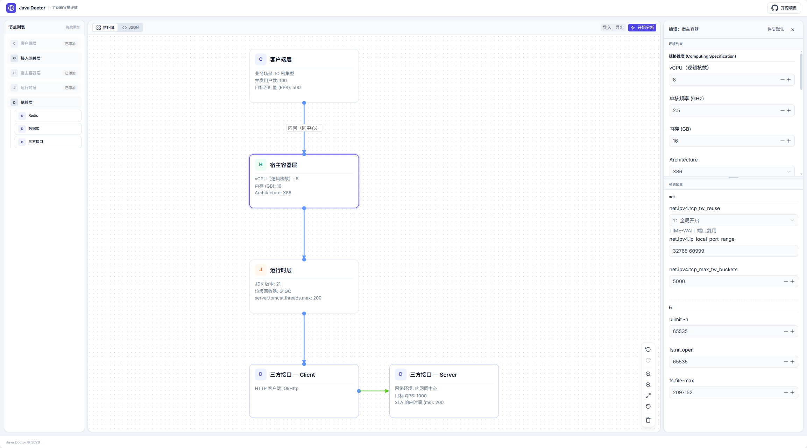

# Newbie Java Doctor 🩺

> 你的 Java 全链路性能调优沙盒与容量规划可视化推演平台。

**[👉 点击这里直接体验 Live Demo ](https://null-object-0000.github.io/newbie-java-doctor/)**



## 💡 为什么做这个项目？

在真实的线上环境中，面对“接口响应慢”、“并发上不去”时，往往只能靠“猜”（盲目加机器、乱调 Tomcat 线程池或 JVM 参数）。现有的 APM 工具（如 SkyWalking）只能告诉你“现在发生了什么”，而压测工具只能告诉你“压到了多少”。

**Newbie Java Doctor 填补了“容量静态规划”与“调优教学”之间的空白：**

1. **可视化排队论沙盒**：将玄学的性能调优转化为基于 Little's Law（利特尔法则）的标准化数学模型。
2. **知其然，更知其所以然**：不仅给出参数建议，更直观展现一个 HTTP 请求是如何在 OS 内核、JVM、中间件中流转并被排队限制的。
3. **为 AI 诊断提供“现场环境”**：打破大模型（ChatGPT/Gemini）排查故障时缺乏“架构拓扑与底层环境配置”上下文的尴尬。

## ✨ 核心能力

* **可视化拓扑建模** — 拖拽节点 + 连线，零代码快速构建你的业务请求链路拓扑图。
* **“What-if” 沙盒推演** — 手动调整 `maxThreads`、`somaxconn` 等参数，实时观察全链路 QPS 天花板的变化。
* **分层瓶颈精准定位** — 自动计算带宽、端口、文件句柄、线程池等维度的理论最大 RPS，标红绝对瓶颈。
* **智能配置推荐** — 针对现有缺口，自动生成系统级与应用级的最优参数调整建议。
* **经典案例模板** — 内置典型故障场景（如慢依赖拖垮线程池），一键加载拓扑并自动分析瓶颈，开箱即用。
* **靶场压测验证** — 提供真实 Docker 化压测沙盒（Java 服务 + K6），让你亲手验证理论推演与实际吞吐量的吻合度。
* **一键环境探针采集** — 提供跨平台 Shell 脚本，一键提取目标 Linux 宿主机与 JVM 运行参数，生成 JSON 导入即用。

## 🚀 快速开始与探针采集

**对于绝大多数用户，本项目无需本地安装部署，直接访问 [Live Demo](https://null-object-0000.github.io/newbie-java-doctor/) 即可使用。**

如果你想直接诊断自己真实的线上环境，可以在目标服务器（Linux）上执行以下命令，自动探测宿主机（OS/内核限制）与运行时（JVM/Tomcat）参数，生成可导入的 JSON 文件：

```bash
curl -fsSL https://raw.githubusercontent.com/null-object-0000/newbie-java-doctor/main/scripts/collect-params.sh | bash -s -- -o topology.json

```

采集完成后，在 Web 页面点击 **「导入」** 选择刚刚生成的 JSON 文件，即可瞬间还原线上环境约束并开始推演！

## 🎯 靶场演练 (Playground)

项目内置了可一键启动的 Docker 化压测靶场，用于验证理论推演与真实吞吐量的吻合度。

### 案例 01：被慢依赖拖垮的聚合服务

> 模拟经典线上故障：下游第三方 API 响应缓慢 (500ms)，导致 Tomcat 线程池迅速耗尽，并发暴跌。

**验证流程：**

1. 在 [Live Demo](https://null-object-0000.github.io/newbie-java-doctor/) 中点击 **「案例模板」** 加载本案例，理论天花板为 **400 QPS**。
2. 启动靶场并注入流量：
   ```bash
   cd playground/demo-01-io-bound-bff
   docker-compose up -d
   docker-compose run --rm k6 run /scripts/test.js
   ```
3. K6 报告中的实际吞吐量将精准卡在 **~400 RPS**，与理论推演吻合。

关键参数已外置为环境变量，**修改后 `docker-compose up -d` 即可重启，无需 rebuild**，可自由进行对比实验（如开启虚拟线程、调整线程池大小等）。详见 [`playground/demo-01-io-bound-bff/README.md`](./playground/demo-01-io-bound-bff/README.md)。

## 🗺️ 演进路线图 (Roadmap)

本项目正处于快速迭代中，未来的目标是将它打造为最懂底层环境的智能诊断平台：

* [x] **基础框架构建**：完成 Vue3 + AntV X6 可视化拖拽、Pinia 历史状态回溯机制。
* [x] **核心引擎雏形**：实现基于 Client -> Host -> Runtime 基础链路的天花板推演算法。

* [ ] **阶段一：打造 Aha Moment (进行中)**
    * [x] 部署纯前端 Live Demo，实现开箱即用的免安装体验。
    * [x] 内置经典故障沙盒模板，首个案例「慢依赖拖垮中间层 — Tomcat 线程池瓶颈」已上线，支持一键加载并自动分析。
    * [ ] 持续补充更多经典故障模板（如：TCP 全连接队列溢出卡顿、数据库连接池排队压垮网关等）。
    * [x] 提供 Docker 化压测靶场（`playground/`），用真实流量验证理论推演结果，支持通过环境变量自由调参进行对比实验。

* [ ] **阶段二：引擎升维与调优知识库**
    * [ ] 将线性计算引擎重构为 DAG（有向无环图）遍历算法，支持多分支复杂依赖节点（Redis、MySQL、微服务）的反向并发压制计算。
    * [ ] 丰富参数科普抽屉（Knowledge Panel），直观展示各参数的作用、底层排队论影响，以及在 Linux/Java 中的查询与修改命令。
    * [ ] **配置面板 Code Mode（代码模式）**：右侧编辑面板支持切换为代码视图，根据节点配置类型智能适配展示格式 —— Spring Boot 节点以 `application.properties` / `application.yml` 形式呈现，Apache HttpClient 等组件则以 Java 代码片段形式展示，所见即所得。
    * [ ] **内联优化建议与瓶颈跳转**：分析完成后，在右侧配置面板中直接标注优化建议与风险提示（如参数偏低警告、推荐值对比）；同时在分析报告中支持点击瓶颈项一键激活并跳转到对应节点的配置页面，实现"发现问题 → 定位调优"的闭环体验。

* [ ] **阶段三：自动化与 AI 赋能**
    * [ ] **“一键 Prompt”导出**：将拓扑 JSON、瓶颈诊断结果与用户报错日志拼接，生成高质量 AI 诊断 Prompt，为大模型提供完美的现场环境上下文。
    * [ ] 开放标准 HTTP 导入协议，探索与成熟 APM 开源项目（如 SkyWalking/Prometheus）结合，直接读取线上真实 RT 与吞吐量进行推演。
    * [ ] 支持将单个拓扑图作为 Sub-graph（子图）暴露，供其他服务作为 HTTP Client 引入。
    * [ ] **拓扑驱动的代码预览（Code Playground）**：提供内置的在线代码编辑器环境，基于当前拓扑图自动生成一套完整的 Spring Boot 核心代码与配置示例 —— 包含 Controller 接口定义、中间件客户端配置类（如 `RestTemplate` / `RedisTemplate` Bean 配置）、`application.yml` 等，直观展示拓扑中各节点参数最终落地到代码层面的完整样貌，帮助用户理解"调了这个参数，代码里到底长什么样"。


## 🏗️ 链路分层模型

为保证推演的严谨性，项目将链路拆解为以下逻辑层：

| 逻辑分层 | 描述说明 | 涵盖参数举例 |
| --- | --- | --- |
| **Client Layer** | 负载目标定义 | 并发用户数、目标吞吐量 (RPS)、预期失败率 |
| **Access Layer** | 接入网关层 | Tengine / Nginx 工作进程数、连接数限制 |
| **Host Layer** | 宿主硬件与内核约束 | vCPU、内存、NIC 带宽、TCP 队列(somaxconn)、文件句柄(fs.file-max) |
| **Runtime Layer** | 应用程序运行时 | JDK 版本、GC 吞吐量目标、Tomcat maxThreads / acceptCount |
| **Dependency Layer** | 外部依赖调用 | Redis 连接池、MySQL 连接池、下游 HTTP 接口耗时 |

> 进阶理论细节，请参阅 [LinkLayer.md](https://www.google.com/search?q=./LinkLayer.md) 和 [Reference.md](https://www.google.com/search?q=./Reference.md)。

## 🤝 参与共建

本项目致力于将“性能调优”这一高门槛技能平民化、工具化。如果你对排队论算法、Vue3 可视化交互、或者底层中间件原理感兴趣，非常欢迎提交 PR 加入我们！

**本地开发指南：**

```bash
# 1. 克隆仓库
git clone https://github.com/null-object-0000/newbie-java-doctor.git
cd newbie-java-doctor

# 2. 安装依赖 (推荐使用 Node 20+)
npm install

# 3. 启动开发服务器
npm run dev

```

## 📄 License

本项目基于 [Apache-2.0](./LICENSE) 协议开源。